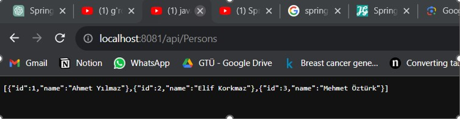
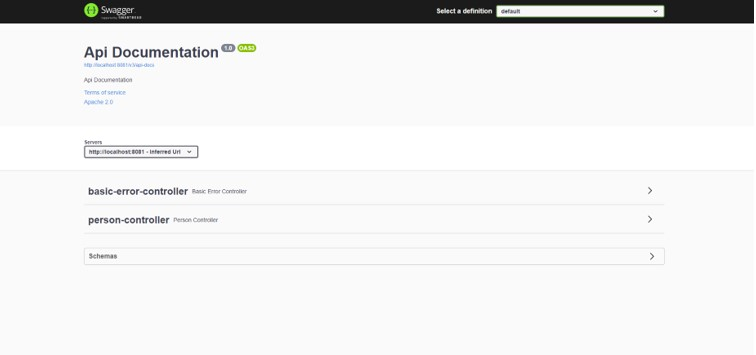
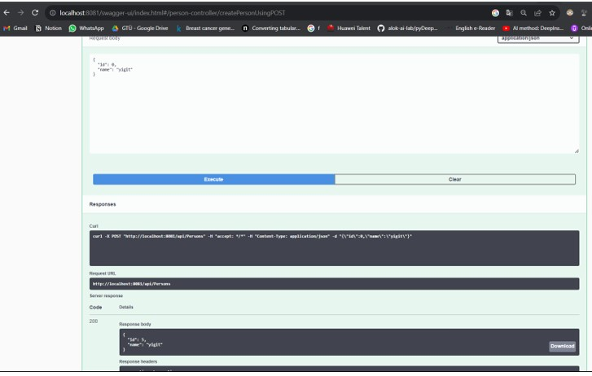

# Proje Adı

Bu projede Spring Boot ve diğer bazı teknolojilerle oluşturulmuş bir web API'si bulunmaktadır. Bu belge, projenin temel özelliklerine ve nasıl kullanılacağına dair bir rehberi içermektedir.

## Başlangıç

Bu projede kullanılan teknolojilerin bir listesi ve kurulum bilgileri buraya gelebilir.

## API Endpoints

### Persons Listesi

Tüm personel listesini görüntülemek için aşağıdaki URL'yi kullanabilirsiniz:

[http://localhost:8081/api/Persons](http://localhost:8081/api/Persons)

### Swagger UI

API'nin interaktif dokümantasyonu ve test arayüzü için Swagger UI'ı kullanabilirsiniz:

[Swagger UI](http://localhost:8081/swagger-ui/index.html#/)

_resim buraya eklenebilir_

## Person Ekleme

Yeni bir person eklemek için aşağıdaki URL üzerinden Swagger UI'ı kullanabilirsiniz:

[Person Ekleme](http://localhost:8081/swagger-ui/index.html#/person-controller/createPersonUsingPOST)

